## One Policy to Control Them All:<br/>Shared Modular Policies for Agent-Agnostic Control ##
### ICML 2020
#### [[Project Page]](https://huangwl18.github.io/modular-rl/) [[Paper]](https://www.cs.cmu.edu/~dpathak/papers/modular-rl.pdf) [[Demo Video]](https://youtu.be/9YiZZ_8guq8) [[Long Oral Talk]](https://youtu.be/gEeQ0nzalzo)

[Wenlong Huang](https://wenlong.page)<sup>1</sup>, [Igor Mordatch](https://scholar.google.com/citations?user=Vzr1RukAAAAJ&hl=en)<sup>2</sup>, [Deepak Pathak](https://www.cs.cmu.edu/~dpathak/)<sup>3 4</sup>

<sup>1</sup>University of California, Berkeley, <sup>2</sup>Google Brain, <sup>3</sup>Facebook AI Research, <sup>4</sup>Carnegie Mellon University<br/>


This is a PyTorch-based implementation of our [Shared Modular Policies](https://huangwl18.github.io/modular-rl/). We take a step beyond the laborious training process of the conventional single-agent RL policy by tackling the possibility of learning general-purpose controllers for diverse robotic systems. Our approach trains a single policy for a wide variety of agents which can then generalize to unseen agent shapes at test-time without any further training.

If you find this work useful in your research, please cite using the following BibTeX:

    @inproceedings{huang2020smp,
      Author = {Huang, Wenlong and
      Mordatch, Igor and Pathak, Deepak},
      Title = {One Policy to Control Them All:
      Shared Modular Policies for Agent-Agnostic Control},
      Booktitle = {ICML},
      Year = {2020}
      }

## Setup
### Requirements
- Python-3.6
- PyTorch-1.1.0
- CUDA-9.0
- CUDNN-7.6
- [MuJoCo-200](https://www.roboti.us/index.html): download binaries, put license file inside, and add path to .bashrc

### Setting up repository
  ```Shell
  git clone https://github.com/huangwl18/modular-rl.git
  cd modular-rl/
  python3.6 -m venv mrEnv
  source $PWD/mrEnv/bin/activate
  ```

### Installing Dependencies
  ```Shell
  pip install --upgrade pip
  pip install -r requirements.txt
  ```

## Running Code
| Flags and Parameters  | Description |
| ------------- | ------------- |
| ``--morphologies <List of STRING>``  | Find existing environments matching each keyword for training (e.g. walker, hopper, humanoid, and cheetah; see examples below)  |
| ``--custom_xml <PATH>``  | Path to custom `xml` file for training the modular policy.<br> When ``<PATH>`` is a file, train with that `xml` morphology only. <br> When ``<PATH>`` is a directory, train on all `xml` morphologies found in the directory.
| ``--td``  | Enable top-down message passing (pass ``--td --bu`` for both-way message passing)  |
| ``--bu``  | Enable bottom-up message passing (pass ``--td --bu`` for both-way message passing)  |
| ``--expID <INT>``  | Experiment ID for creating saving directory  |
  | ``--seed <INT>``  | (Optional) Seed for Gym, PyTorch and Numpy  |
  
### Train with existing environment
- Train both-way SMP on ``Walker++`` (12 variants of walker):
```Shell
python main.py --expID 001 --td --bu --morphologies walker
  ```
- Train both-way SMP on ``Humanoid++`` (8 variants of 2d humanoid):
```Shell
python main.py --expID 002 --td --bu --morphologies humanoid
  ```
- Train both-way SMP on ``Cheetah++`` (15 variants of cheetah):
```Shell
python main.py --expID 003 --td --bu --morphologies cheetah
  ```
- Train both-way SMP on ``Hopper++`` (3 variants of hopper):
```Shell
python main.py --expID 004 --td --bu --morphologies hopper
  ```
  - To train both-way SMP for only one environment (e.g. ``walker_7_main``), specify the full name of  the environment without the ``.xml`` suffix:
```Shell
python main.py --expID 005 --td --bu --morphologies walker_7_main
  ```
 To run with one-way message passing, disable ``--td`` for bottom-up-only message passing or disable ``--bu`` for top-down-only message passing.
 To run without any message passing, disable both ``--td`` and ``--bu``.

### Train with custom environment
- Train both-way SMP for only one environment:
```Shell
python main.py --expID 006 --td --bu --custom_xml <PATH_TO_XML_FILE>
  ```
- Train both-way SMP for multiple environments (``xml`` files must be in the same directory):
```Shell
python main.py --expID 007 --td --bu --custom_xml <PATH_TO_XML_DIR>
  ```
Note that the current implementation assumes all custom MuJoCo agents are 2D planar and contain only one ``body`` tag with name ``torso`` attached to ``worldbody``.

### Visualization
- To visualize all ``walker`` environments with the both-way SMP model from experiment ``expID 001``:
```Shell
python visualize.py --expID 001 --td --bu --morphologies walker
```
- To visualize only ``walker_7_main`` environment with the both-way SMP model from experiment ``expID 001``:
```Shell
python visualize.py --expID 001 --td --bu --morphologies walker_7_main
```

## Provided Environments

<table>
    <tbody>
        <tr>
            <td align="center" style="text-align:center" colspan=6><b>Walker</b></td>
        </tr>
        <tr>
            <td align="center" style="text-align:center"><br>walker_2_main</td>
            <td align="center" style="text-align:center"><br>walker_3_main</td>
            <td align="center" style="text-align:center">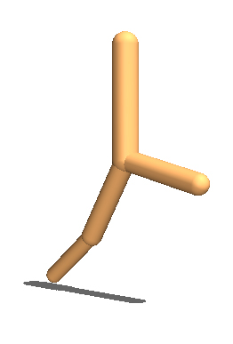<br>walker_4_main</td>
            <td align="center" style="text-align:center">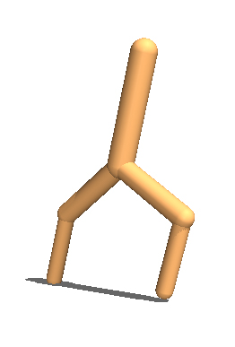<br>walker_5_main</td>
            <td align="center" style="text-align:center"><br>walker_6_main</td>
            <td align="center" style="text-align:center">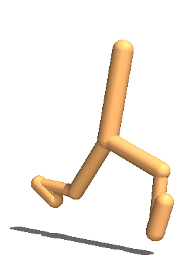<br>walker_7_main</td>
        </tr>
        <tr>
            <td align="center" style="text-align:center"><br>walker_2_flipped</td>
            <td align="center" style="text-align:center"><br>walker_3_flipped</td>
            <td align="center" style="text-align:center"><br>walker_4_flipped</td>
            <td align="center" style="text-align:center"><br>walker_5_flipped</td>
            <td align="center" style="text-align:center">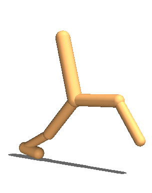<br>walker_6_flipped</td>
            <td align="center" style="text-align:center"><br>walker_7_flipped</td>
        </tr>
    </tbody>
</table>


<table>
    <tbody>
        <tr>
            <td align="center" style="text-align:center" colspan=4><b>2D Humanoid</b></td>
        </tr>
        <tr>
            <td align="center" style="text-align:center">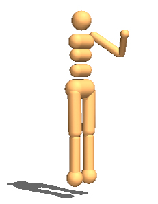<br>humanoid_2d_7_left_arm</td>
            <td align="center" style="text-align:center">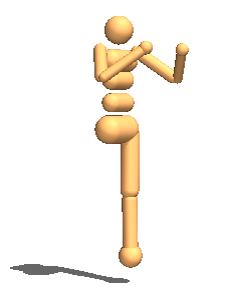<br>humanoid_2d_7_left_leg</td>
            <td align="center" style="text-align:center">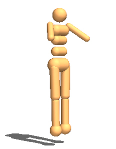<br>humanoid_2d_7_lower_arms</td>
            <td align="center" style="text-align:center">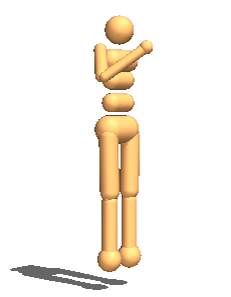<br>humanoid_2d_7_right_arm</td>
        </tr>
        <tr>
            <td align="center" style="text-align:center">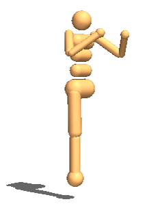<br>humanoid_2d_7_right_leg</td>
            <td align="center" style="text-align:center"><br>humanoid_2d_8_left_knee</td>
            <td align="center" style="text-align:center">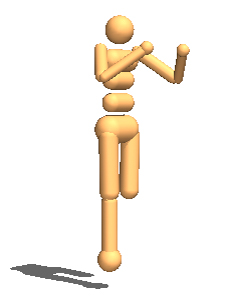<br>humanoid_2d_8_right_knee</td>
            <td align="center" style="text-align:center">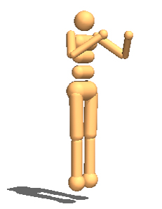<br>humanoid_2d_9_full</td>
        </tr>
    </tbody>
</table>


<table>
    <tbody>
        <tr>
            <td align="center" style="text-align:center" colspan=5><b>Cheetah</b></td>
        </tr>
        <tr>
            <td align="center" style="text-align:center">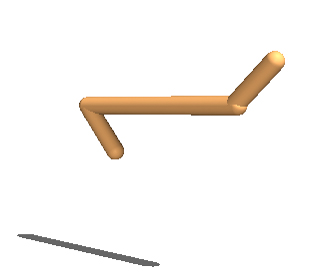<br>cheetah_2_back</td>
            <td align="center" style="text-align:center">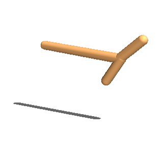<br>cheetah_2_front</td>
            <td align="center" style="text-align:center">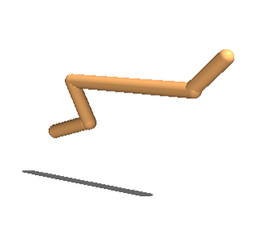<br>cheetah_3_back</td>
            <td align="center" style="text-align:center">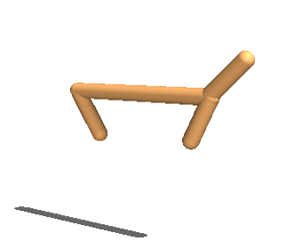<br>cheetah_3_balanced</td>
            <td align="center" style="text-align:center">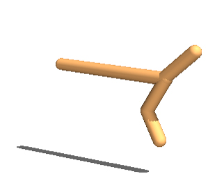<br>cheetah_3_front</td>
        </tr>
        <tr>
            <td align="center" style="text-align:center">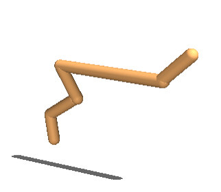<br>cheetah_4_allback</td>
            <td align="center" style="text-align:center">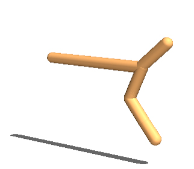<br>cheetah_4_allfront</td>
            <td align="center" style="text-align:center">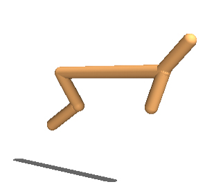<br>cheetah_4_back</td>
            <td align="center" style="text-align:center">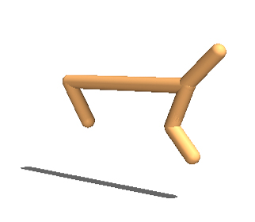<br>cheetah_4_front</td>
            <td align="center" style="text-align:center">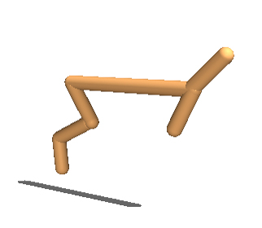<br>cheetah_5_back</td>
        </tr>
        <tr>
            <td align="center" style="text-align:center">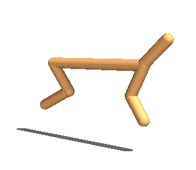<br>cheetah_5_balanced</td>
            <td align="center" style="text-align:center">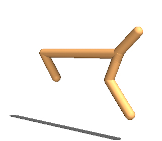<br>cheetah_5_front</td>
            <td align="center" style="text-align:center"><br>cheetah_6_back</td>
            <td align="center" style="text-align:center">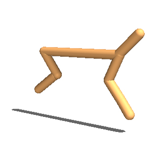<br>cheetah_6_front</td>
            <td align="center" style="text-align:center">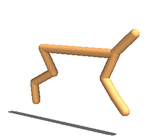<br>cheetah_7_full</td>
        </tr>
    </tbody>
</table>

<table>
    <tbody>
        <tr>
            <td align="center" style="text-align:center" colspan=3><b>Hopper</b></td>
        </tr>
        <tr>
            <td align="center" style="text-align:center">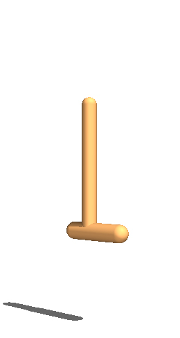<br>hopper_3</td>
            <td align="center" style="text-align:center">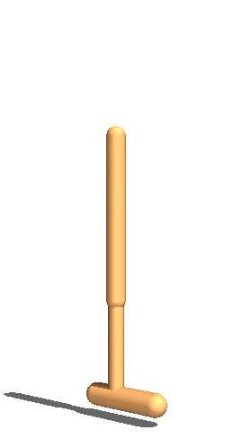<br>hopper_4</td>
            <td align="center" style="text-align:center">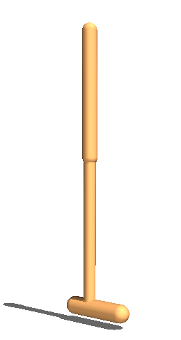<br>hopper_5</td>
        </tr>
    </tbody>
</table>

Note that each walker agent has an identical instance of itself called ``flipped``, for which SMP always flips the torso message passed to both legs (e.g. the message that is passed to the left leg in the ``main`` instance is now passed the right leg).

## Acknowledgement
The TD3 code is based on this [open-source implementation](https://github.com/sfujim/TD3). The code for Dynamic Graph Neural Networks is adapted from [Modular Assemblies (Pathak*, Lu* et al., NeurIPS 2019)](https://pathak22.github.io/modular-assemblies/).

